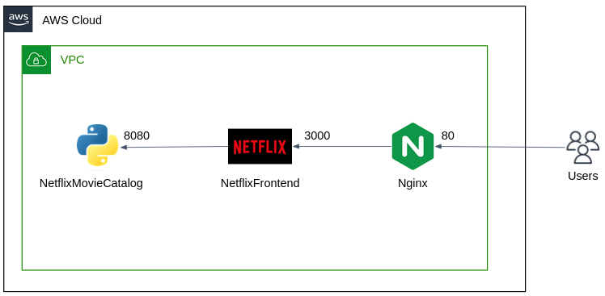

# Nginx_And_Chill

## DevOps Bootcamp UPES 2024 Project

### Overview

This project demonstrates the creation of a CI/CD pipeline using GitHub Actions to deploy a Netflix Movie Catalog and Netflix Frontend application on an AWS EC2 instance. The applications are containerized using Docker and served using Nginx.

### Table of Contents

- [Team Members](#team-members)
- [Project Structure](#project-structure)
- [Technologies Used](#technologies-used)
- [Setup Instructions](#setup-instructions)
- [CI/CD Pipeline](#cicd-pipeline)
- [Deployment](#deployment)
- [License](#license)

### Team Members

- [**Anshika Srivastava**](https://github.com/anshikasrivastava17)
- [**Anurag Negi**](https://github.com/Anurag-Negi28)
- [**Dhruv Jain**](https://github.com/Dhruv-Jain31)
- [**Sairanjan Subudhi**](https://github.com/Sairanjan-Subudhi)

### Project Structure



### Technologies Used

- **Docker**: Containerization of applications.
- **Nginx**: Web server to serve the frontend and backend applications.
- **GitHub Actions**: CI/CD pipeline automation.
- **AWS EC2**: Cloud infrastructure for deployment.

### Setup Instructions

1. **Clone the Repository:**

   ```sh
   git clone https://github.com/your-repo/Nginx_And_Chill.git
   cd Nginx_And_Chill

   ```

   - Use **Docker containers** for all services.

- For Nginx

```
sudo docker pull nginx
```

- For Netflix Frontend

```
sudo docker pull anshikasrivastava1718/netflix-frontend:v0.0.1
```

- For Netflix Movie Catalog

```
 sudo docker pull anshikasrivastava1718/netflix-movie-catalog:v0.0.1
```
